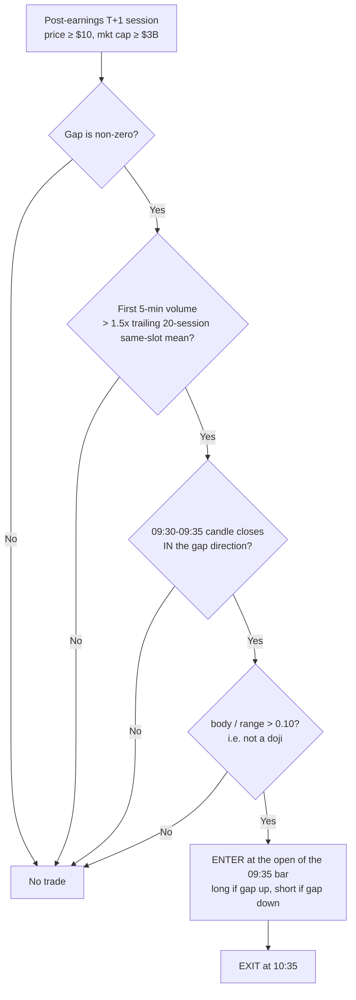
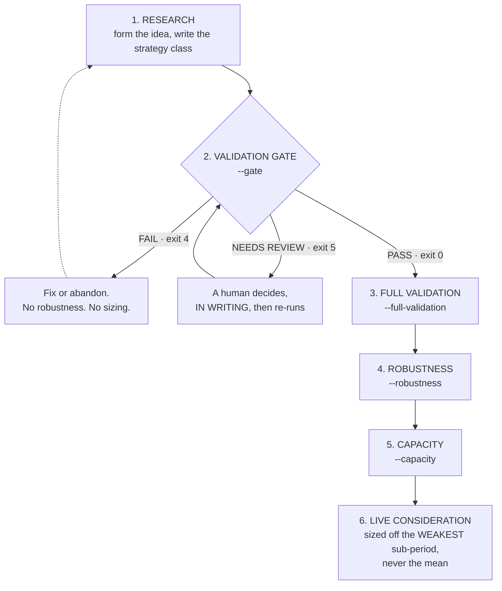
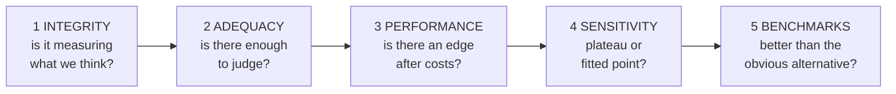
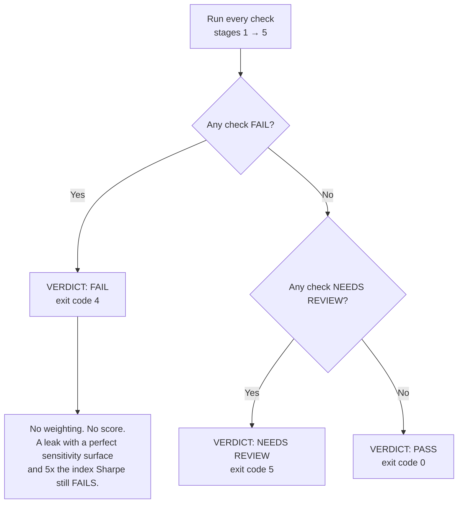
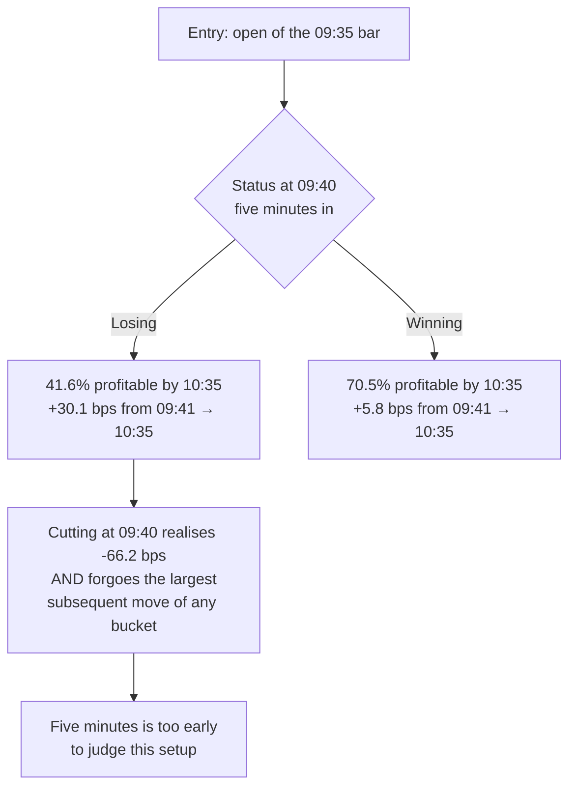

# Backtesting Framework – Complete Notes

**Last updated:** 2026-08-16
**Purpose:** Single reference for the research & validation process built
for the Post-Earnings High-Volume Continuation edge, and for every
strategy after it.

**Rule for this note:** every number is traceable to a named report in
`lambda_strategy_validation/`. A figure with no source does not belong
here. When this note and a report disagree, **the report wins** — then
fix this note.

> [!warning] Two corrections to the earlier draft
> 1. **"The edge is front-loaded (strongest in the first 15–30 min)" is
>    wrong.** What is front-loaded is the cost of being *late to enter*
>    (§7). The edge itself is not concentrated early: holding a second
>    hour adds +3.0 bps, and 5-minute *losers* go on to make the largest
>    subsequent move of any bucket (§6.1). Acting on the original wording
>    would mean cutting losers at 5–15 minutes, which is precisely the
>    wrong trade.
> 2. **The ATR −1.0 stop does not simply "reduce large losses".** It
>    makes maximum drawdown *worse*, not better (§6.2).

---

## 1. Overall Philosophy

- A good backtest is **necessary but not sufficient**.
- Validation is a **gate**, not a report. A report you can read past; a
  gate returns a non-zero exit code.
- **Integrity outranks performance, always.** No look-ahead, correct
  universe, point-in-time only. There is no override flag.
- Distribution and tails matter as much as the average.
- Point-in-time safety comes from **withholding data, not policing
  code**. The strategy is handed a view that stops strictly before the
  decision instant, so trailing statistics are trailing by construction
  and there is no `.shift()` anyone has to remember.
- Signal logic is roughly **10%** of a live system. The rest is
  infrastructure and process.

---

## 2. Core Edge Definition (Current Best)

| Element | Specification |
|---|---|
| Name | Post-Earnings T+1 High-Volume Continuation |
| Universe | US stocks, post-earnings T+1, non-zero gap |
| Liquidity screen | Price ≥ \$10, mkt cap ≥ \$3B, corrected **within-year** liquidity rank (`screen_v2`) |
| Signal | First 5-min volume > **1.5×** trailing 20-session same-slot mean, **and** a continuation candle |
| Continuation | 09:30–09:35 candle closes **in** the gap direction and is not a doji |
| Doji | body / range ≤ 0.10, so non-doji is **> 0.10** |
| Entry | **Open of the 09:35 bar**, market |
| Exit | 10:35 (1 hour) |
| Direction | Signed by the gap — long gap-up, short gap-down |
| Costs | 6.6 bps round trip; stressed at 10 / 15 / 25 / 35 |

> [!info] There is **no cap on gap size, and no floor**
> Gaps in the cohort run 0.00%–36.9% (0–14.2 ATR). **42% of trades have
> gaps under 0.5 ATR and that bucket carries 45% of all P&L** — the
> smallest gaps are the largest contributor. Capping at 1 ATR costs
> 2.5 bps of mean and cuts standard deviation by 16%.

### The signal, as a decision tree

---

## 3. Validated Results

### Capitalised backtest — \$1M, 0.5% risk, max 5 concurrent, 6.6 bps
*(FULLVAL_REPORT.md — 4,270 screened trades, 515 tickers, 2015–2025)*

| | No stop | ATR −1.0 stop |
|---|---|---|
| Final equity | \$6.62M | \$5.18M |
| CAGR | 18.79% | 16.17% |
| Ann. vol | 6.66% | 6.42% |
| Sharpe (rf=0) | **2.82** | 2.52 |
| Max drawdown | −6.46% | **−7.06% (worse)** |
| Time in market | 7.4% of clock time | same |

> [!danger] The 2.82 Sharpe is flattered by idle days
> Volatility on days capital is **actually working** is **22.4%**, not
> 6.7%. The book holds nothing on 92.6% of sessions and those zeros go
> into the denominator. **Size off the deployed figure.** This is also
> why the gate prints `pct_days_active` and `deployed_vol` next to every
> Sharpe it reports.

### vs SPY *(BUYHOLD_REPORT.md)*
\$6.62M vs \$3.74M. Correlation **0.016**, beta **0.0075**. Beats SPY in
only 5 of 11 years — but the strategy returned 7–32% *every* year, so
who wins is decided by what SPY did. It beat SPY by ~30 points in both
down years (2018, 2022) and lost in every year SPY returned > ~18%. No
negative rolling 12-month window in the sample, against SPY's −15.8%.

### Decay is real *(FULLVAL, VOLUME_INTEGRITY)*
Average trade **36 bps (2015–19) → 22 bps (2020–25)**. CAGR 23.3% vs
11.3%. Trades losing more than 1 ATR rose 10.0% → 12.0% while the edge
thinned. **Size off the recent half, not the full sample.**

### Costs decide it *(FULLVAL)*
6.6 bps → 18.8% CAGR · 15 bps → 12.7% · **25 bps → 5.8%**. Gross edge is
35.7 bps, so the edge **dies near 36 bps round trip**, about 5.4× the
assumption.

### Long vs short *(FULLVAL)*
Short **30.5 bps/trade** vs long 20.4. **The better half is the one
carrying unmodelled borrow cost.**

---

## 4. Mandatory Workflow

The order is not a suggestion. Every step exists because skipping it
produced a wrong number at least once.

**Why the gate comes second, not last.** Robustness and capacity answer
*"how good is it, really"*. They are expensive and meaningless if the
strategy is reading future data or trading a cohort nobody intended. The
gate answers the prior question — *is this measuring what we think it is
measuring* — and it is cheap.

> Running robustness on an unvalidated strategy produces a beautifully
> detailed description of an artefact.

**Three verdicts, not two.** `NEEDS REVIEW` exists because *"we cannot
tell yet"* and *"this does not work"* are different findings. Collapsing
them into FAIL teaches people to ignore the gate.

---

## 5. The Validation Gate

Five stages, fixed order. Each is more expensive than the one before and
meaningless without it.

### Stage 1 — Integrity (hard fail, cannot be outvoted)

| Check | Fails when |
|---|---|
| `no_lookahead` | the future changes a decision |
| `universe_applied` | REVIEWS when no provider is set, so "every session" is a visible choice |
| `trades_exist` | zero trades — nothing can be judged |
| `stale_exits` | too many exits fell back to a stale close |

### Stage 2 — Adequacy
Trades, tickers, years, and concentration. Nothing is broken; nothing is
proven either. All produce NEEDS REVIEW.

Concentration is measured against **gross** P&L, not net. A share of net
is unbounded when winners and losers nearly cancel — it printed *"273%
of P&L"* on the first run here, which was arithmetically true and
useless.

### Stage 3 — Performance
Expectancy, profit factor, share of positive years, and **cost
headroom**: the edge must survive a multiple of the assumed cost.

### Stage 4 — Sensitivity *(built)*

`volume_ratio_min`, the doji threshold and `hold_minutes` each move
**±10% and ±20%**, and the **whole path is re-run** — signals
regenerated, portfolio re-simulated. Two of the three are signal
filters, so re-costing the baseline trade log cannot see them.

$$\text{spike ratio} = \frac{\text{baseline expectancy}}{\text{median expectancy of its own neighbours}}$$

**1.0 is a plateau.** Well above 1.0 is what a fitted parameter looks
like from the outside.

| Check | Fails when |
|---|---|
| `sensitivity_stability` | under half the neighbourhood is still profitable |
| `sensitivity_spike` | the chosen values earn more than **3×** the median of their neighbours |

Two guards worth knowing:
- The ratio is **NaN** whenever the neighbourhood median is ≤ 0, because
  a non-positive denominator turns a collapsing neighbourhood into a
  large positive number that reads like good news. *(§9 — this project
  has produced that exact artefact twice.)*
- Variants that returned the baseline result **unchanged** are counted
  separately (`n_binding`) and earn no pass. A filter loose enough to be
  inert would otherwise sail through as "stable".

### Stage 5 — Benchmarks *(built)*

| Check | Fails when |
|---|---|
| `benchmark_vs_index` | Sharpe is at or below SPY buy-and-hold **over the strategy's own window** |
| `benchmark_vs_longer_hold` | **never fails**; REVIEWS when holding the same names longer beats the configured hold by more than 0.10 Sharpe |

Buy-and-hold is priced over exactly the sessions traded, not a
remembered long-run average — so a strategy that ran through a bull
market is measured against that bull market. The longer holds re-run the
identical signals at 2× and 4× the hold, capped at the session close.

The longer-hold check reviews but never fails: a longer hold winning
does not make the edge fake, it makes the **chosen exit** questionable,
and that is a human judgement.

> [!warning] The comparison that is not fair, and is printed anyway
> An intraday book holding positions 7% of the clock has almost no
> volatility on the other 93% of days, so its Sharpe is structurally
> flattered against a fully-invested index. The gate prints
> `pct_days_active` and `deployed_vol` beside the Sharpe and says *"the
> strategy is idle on 93% of sessions, so this margin is flattered"* —
> **on the passing line**. Nothing is silently adjusted, because there
> is no single defensible adjustment.

### How a verdict is reached

### What the gate deliberately does not do

It does not tune, rank, or pick a best variant. It runs **one**
configuration and judges it. The moment a gate starts searching for a
version that passes, it has become an overfitting engine wearing a
gate's clothes. Sensitivity reports the *neighbourhood* of the declared
configuration and never returns a better value.

**Skipping is visible, never silent.** `--no-extended` and a missing SPY
series both emit their checks as NEEDS REVIEW saying what did not run. A
skipped test and a passed test must not look alike in the artefact.

---

## 6. Behavioural Findings — the three most often misremembered

### 6.1 Losers at 5 minutes RECOVER — do not cut them early
*(PATH_REPORT.md. This is the opposite of the intuitive reading.)*

Conditioning is on the **09:40 (5-minute) status**, not 15 or 30 min.

| Status at 09:40 | % profitable at 10:35 | Subsequent move 09:41→10:35 |
|---|---|---|
| **Losers** | 41.6% (39.8% net) | **+30.1 bps — largest of any bucket** |
| Winners | 70.5% (68.9% net) | +5.8 bps |

The worst 5-minute losers (−100 bps at 09:40) go on to make +37.0 bps.
They still finish the hour at −64 bps, so it is a **partial** recovery,
not a round trip.

### 6.2 The ATR −1.0 stop is mostly whipsaw
Of the 391 trades it fires on, **57.3% would have ended better without
it**. Average damage −138 bps against +108 bps saved. Net **−3.7
bps/trade**, and **maximum drawdown gets worse** (−7.06% vs −6.46%). It
does cut the far-left tail; it does not improve the outcome.

### 6.3 One hour is the sweet spot, but barely
*(LONGHOLD_REPORT.md)* 1 hour +30.1 bps; 2 hours +33.0 bps — the extra
hour adds **+3.0 bps, CI [−0.5, +6.6], p = 0.105**, i.e. not
significant. Beyond 2 hours adds nothing.

> "Front-loaded" refers to **entry-delay decay** (§7), not to the edge
> being concentrated in the first 15–30 minutes.

### 6.4 Other confirmed results
- **Limit entries lose.** No limit rule beat the market order *even on
  filled trades*; the patience cost more than the better price gained
  (ENTRYLIMITS_REPORT.md).
- **Overnight residual ≈ 0** (OVERNIGHT_REPORT.md).
- **High gap/ATR + very high volume**: higher mean **and** a fatter left
  tail. Both, not one.

---

## 7. Being Late Is Expensive *(TIMING_REPORT.md)*

Signal known at 09:35; only the *fill* moves; exit stays 10:35.

| Fill | Net bps | Edge kept |
|---|---|---|
| 09:35 | 29.65 | 100% |
| 09:36 | 23.74 | **80%** |
| 09:40 | 14.90 | 50% |
| 09:50 | −1.59 | negative |

> [!danger] One minute late costs 5.9 bps
> That is **20% of the edge — more than the entire 6.6 bps cost
> assumption**. Execution speed is worth more than any cost negotiation
> available, and it is the most certain improvement on the list.

---

## 8. Data Integrity — known and bounded

### 8.1 The volume series changes basis on 2022-03-07
*(VOLUME_INTEGRITY_REPORT.md)* Not 2022-03-01 — the pipeline's
`IEX_BREAK` constant is four sessions early, which is harmless. From
that date the HF volume series is **IEX-only prints, 3.0–3.8% of
consolidated**, verified against an independent source. Volume **falls
~10×**; it does not rise.

**The filter survives it.** It is a ratio against its own trailing mean,
so the rescaling cancels. Incremental value **20.3 bps pre-break vs 17.0
post**; difference −2.9 bps, 95% CI **[−15.4, +11.6]** — spans zero.
Prices are unaffected; IEX prints are real trades.

### 8.2 A deliberate 4-month hole
**No events exist between 2022-03-01 and 2022-06-29.**
`run_study.break_aware_liquidity` excises every row whose 63-session
trailing window straddles the break. **Do not read a 2022 number as a
regime signal.**

---

## 9. Engine Status and the Reconciliation

`backtester/` — steps 1–7 complete, plus the universe provider and the
validation gate. **179 assertions across six suites.** See `WORKFLOW.md`
and `LIMITATIONS.md` in that folder.

### What was reconciled against the research
*(`tools/reconcile_research.py`, 1,103 trades, 60 tickers)*

| Check | Result |
|---|---|
| Entry price vs `entry_px_0935` | **100.00% exact**, max diff 0.0000 bps |
| 1-hour return, matched convention | **100.00% exact**, max diff 0.0000 bps |
| MAE (ATR) | 95.7% within 0.001 |

> [!info] One convention difference, and it matters when comparing numbers
> The research exits at the **close of the 10:34 bar** (`EXIT_MIN = 64`);
> the engine exits at the **open of the 10:35 bar**. Both are the instant
> 10:35:00 — different prints. Gap: **+0.187 bps mean, sd 5.29, max 32.6
> on a single trade.** The tool reports both.

### NOT reconciled — do not assume these match
ATR, volume ratio, candle classification, universe selection. Their
inputs no longer exist on disk: the research kept 1-minute bars only in
a **±1 session window around each event** (3 sessions, 90 minutes each),
so ATR(14) and the 20-session volume baseline cannot be recomputed. The
engine correctly emits **zero** signals on that data.

**Blocker:** continuous 1-minute bars covering ≥20 sessions before each
event, plus an earnings calendar with BMO/AMC timing. Even 20 tickers
over 2 years would unblock cohort reconciliation.

### The recurring bug class, written down so it stops recurring
**Check every ratio whose denominator can be small or negative.** This
project produced *"kept 123% of edge"* out of a growing loss, and
*"largest name is 273% of P&L"* from winners cancelling losers. Both are
now guarded (`capacity._kept`, gross-P&L concentration,
`sensitivity._spike`). The pattern will recur in the next module.

---

## 10. Remaining Gate Enhancements

| Test | Question it answers | Status |
|---|---|---|
| **Sensitivity** | Does performance hold when parameters move slightly? | **Built** — §5 stage 4 |
| **Benchmarking** | Better than SPY, and better than just holding longer? | **Built** — §5 stage 5 |
| **Permutation / label shuffle** | Could this result appear by chance? Shuffle the signal dates within each ticker and re-run; the real result should sit outside the shuffled distribution. | Future — the strongest remaining test |
| **Partition** | How much of the profit is timing skill vs simple market drift over the held hour? | Future |
| **Multi-parameter grid** | The current sweep moves **one** parameter at a time, so a strategy fragile to a *pair* of them passes. | Future, and deliberately outside the gate — a full grid starts to look like a search |
| **Multi-day hold comparison** | "Held longer" currently means up to 16:00, never overnight. Needs a portfolio loop that carries positions. | Future |

---

## 11. Highest-Priority Open Research Questions

1. **Conditional hold to the close.** Given status at 5/15/30/60 min,
   what is the expectancy *and the full distribution* if held to 16:00?
   §6.1 shows 5-minute losers already recover materially by 10:35 — the
   open question is whether that continues to the close. **Distribution,
   not averages.**
2. **4-minute candle** (09:30–09:34, enter 09:34). Retention is 90.3%
   and the skipped minute moves +10.2 bps in the eventual direction, so
   the upper bound is ~9.2 bps (≈31% uplift). **Not testable on current
   data** — a 4-min volume ratio needs a trailing baseline over minutes
   0–3 on *non-event* sessions.
3. **High-volume Reversal.** Fade vs follow; 15-minute behaviour;
   relative strength vs SPY.
4. **Borrow cost on the short side** — the largest unmodelled cost, and
   it lands on the better-performing leg.
5. **Walk-forward / regime stability** beyond the period splits.

---

## 12. Live / Implementation Notes

- The backtest assumes a fill **at** the 09:35 open. No manual process
  achieves that. **If consistently 1–2 minutes slow, realistic
  expectancy is 20–24 bps, not 29.7** — and that gap is *execution*, not
  decay.
- Pre-staged order tickets + hotkeys is the fastest manual method on
  IBKR.
- Native IBKR conditional orders **cannot** express "candle close +
  volume ratio".
- Automation via **Futu OpenD + `futu-api`** is installed and is the
  real fix. OpenD must run on the local machine (GUI login required).
- Still to build: broker reconciliation, state persistence, kill switch,
  order logging, market-hours guards. **Signal logic is ~10% of a live
  system.**

---

## 13. The Question to Keep Asking

> **What is the minimum set of validation tests I will commit to running
> on every new strategy, before I let myself look at its returns?**

Current answer: `--gate`, all five stages, with a real universe provider
and a real benchmark series. Everything downstream of it is optional
until it passes.

---

## 14. One-Paragraph Status

A real, low-beta (β ≈ 0.008) post-earnings high-volume continuation edge
that survives realistic capital constraints: **18.8% CAGR on \$1M at
0.5% risk with a −6.5% drawdown, deployed 7.4% of clock time**. It has
roughly halved since 2020, dies near **36 bps round trip**, and carries
unmodelled borrow on its better-performing short leg. The engine's
*execution path* reconciles exactly against the research; its *signal
path* is unverified and blocked on continuous 1-minute data plus an
earnings calendar. Highest-priority research is the conditional
hold-to-close decision — noting that **5-minute losers recover +30.1 bps
by 10:35, so early stops are contraindicated**. Live execution speed is
worth ~6 bps per trade and is the most certain available improvement.

---
**End of note**
