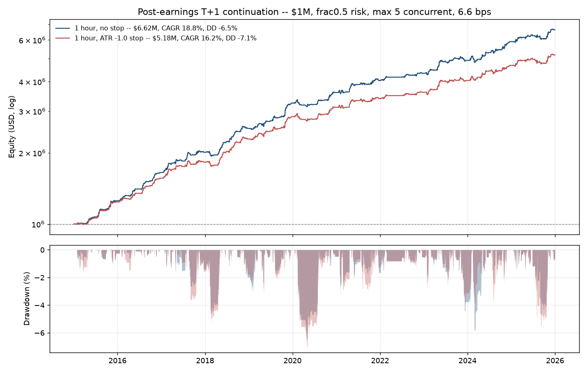

# Full validation -- post-earnings T+1 continuation, $1,000,000

4,270 signals, 515 tickers, 2015-01-27 to 2025-12-19,
2,766 sessions. 51.3% long / 48.7% short.

Base configuration for every table unless stated: **fixed fractional
0.5% risk, max 5 concurrent positions, 6.6 bps**. Grids for the
other sizings, limits and costs are in section E.

## Assumptions, stated plainly

| Assumption | Choice | Consequence |
|---|---|---|
| Signal selection when a day exceeds the position limit | Highest volume ratio first | Known at 09:35, no look-ahead. Random selection instead gives CAGR 17.9% vs 18.8%, so ~0.9 pp of the result is this rule |
| Risk unit for fixed-fractional sizing | shares = risk$ / 1.0 ATR | A real stop distance for the stopped version; a **risk proxy only** for the unstopped one, which can and does lose more than its nominal budget |
| Leverage | 1x gross, pro-rata scaled when breached | Binds regularly: average gross when active is 52% at 0.5% risk, 74% at 1.0% |
| Idle cash | 0% | Understates every configuration equally |
| Costs | 6.6 bps round trip, flat | No spread widening for small caps or high-volatility mornings |
| Position lifetime | Intraday only, 09:35 to 10:35 | No overnight risk; the book is flat every night |

## A. Equity curve and risk

| metric | no stop | ATR -1.0 stop |
|---|---|---|
| Final equity | $6,621,113 | $5,182,125 |
| Total return | 562.1% | 418.2% |
| CAGR | 18.79% | 16.17% |
| Annualised volatility | 6.66% | 6.42% |
| Sharpe (rf = 0) | 2.82 | 2.52 |
| Max drawdown | -6.46% | -7.06% |
| Calmar | 2.91 | 2.29 |
| Trades taken | 3,454 | 3,454 |
| Signals taken (of all fired) | 80.9% | 80.9% |
| Sessions with a position | 47.9% | 47.9% |
| Time in market (clock) | 7.4% | 7.4% |
| Avg gross exposure when active | 52% | 52% |
| Avg positions when active | 2.6 | 2.6 |

Capital utilisation is the number that reframes everything else: the
strategy holds a position on 47.9% of sessions but for one hour each
time, so it is in the market roughly **7.4% of market clock time**, at
about 52% gross when it is. The Sharpe of 2.82 is computed on a
daily series that is more than half zeros, which flatters it; treat it
as a property of this capital-allocation scheme, not of the trades.

The position limit is binding. Only 80.9% of signals are taken at max
5, and the average active day carries 2.6 positions -- so the book is
usually not full, but the busy days are truncated.

## B. Year by year

**ATR -1.0 stop**

| year | net return | max DD | Sharpe | trades | win rate | avg trade (bps) | skew (wins.) | ex-kurt (wins.) | % losing >1 ATR |
|---|---|---|---|---|---|---|---|---|---|
| 2015 | 23.97% | -1.77% | 4.20 | 269 | 63.57% | 37.45 | 0.059 | 0.379 | 7.43% |
| 2016 | 25.94% | -1.48% | 4.98 | 268 | 63.43% | 49.06 | 0.511 | 0.982 | 8.58% |
| 2017 | 16.90% | -3.68% | 2.42 | 318 | 56.29% | 29.24 | 1.108 | 2.083 | 14.15% |
| 2018 | 25.31% | -5.58% | 3.77 | 328 | 59.15% | 32.83 | 0.403 | 1.611 | 8.23% |
| 2019 | 24.25% | -3.27% | 3.44 | 351 | 55.56% | 30.00 | 0.285 | 0.187 | 11.68% |
| 2020 | 9.53% | -7.06% | 1.55 | 335 | 54.03% | 12.68 | 0.372 | 1.438 | 9.25% |
| 2021 | 8.71% | -2.97% | 1.35 | 337 | 55.79% | 13.30 | 0.001 | 1.116 | 12.46% |
| 2022 | 6.50% | -1.27% | 1.68 | 211 | 56.87% | 32.68 | 0.212 | 0.897 | 8.06% |
| 2023 | 12.15% | -3.78% | 1.85 | 351 | 52.42% | 23.18 | 0.695 | 0.982 | 13.11% |
| 2024 | 15.85% | -3.85% | 2.11 | 323 | 53.56% | 32.24 | 0.460 | 0.061 | 15.79% |
| 2025 | 10.66% | -5.47% | 1.40 | 363 | 52.07% | 18.21 | 0.272 | -0.083 | 13.22% |

**No stop**

| year | net return | max DD | Sharpe | trades | win rate | avg trade (bps) | skew (wins.) | ex-kurt (wins.) | % losing >1 ATR |
|---|---|---|---|---|---|---|---|---|---|
| 2015 | 25.41% | -1.33% | 4.37 | 269 | 64.31% | 39.28 | -0.071 | 0.908 | 2.60% |
| 2016 | 31.63% | -1.15% | 6.03 | 268 | 64.55% | 56.95 | 0.632 | 1.047 | 2.24% |
| 2017 | 21.77% | -2.73% | 2.98 | 318 | 57.86% | 34.83 | 1.027 | 2.373 | 5.35% |
| 2018 | 26.16% | -5.17% | 3.92 | 328 | 59.45% | 33.68 | 0.309 | 1.933 | 3.35% |
| 2019 | 27.93% | -3.03% | 3.81 | 351 | 56.98% | 33.63 | 0.106 | 0.492 | 5.13% |
| 2020 | 10.84% | -6.46% | 1.75 | 335 | 55.22% | 16.09 | 0.250 | 1.677 | 4.48% |
| 2021 | 12.36% | -3.38% | 1.83 | 337 | 56.68% | 21.55 | 0.071 | 1.198 | 5.04% |
| 2022 | 7.36% | -1.65% | 1.89 | 211 | 56.87% | 36.47 | 0.362 | 0.849 | 4.74% |
| 2023 | 13.33% | -4.41% | 1.95 | 351 | 53.85% | 24.63 | 0.540 | 1.166 | 6.55% |
| 2024 | 19.99% | -5.81% | 2.40 | 323 | 54.80% | 35.62 | 0.226 | 0.310 | 8.98% |
| 2025 | 12.25% | -4.69% | 1.57 | 363 | 53.17% | 19.99 | -0.060 | 0.508 | 6.34% |

The decay is the headline. Average trade falls from 36 bps across
2015-2019 to 22 bps across 2020-2025, and win rate slides from the
low 60s to the low 50s. Every year is positive, but the last six are
roughly half the first five.

## C. Distribution and tail metrics

Overall, on trades actually taken by the base configuration:

| exit | n | mean | median | std | win rate | p10 | p25 | p75 | p90 | skew (wins.) | ex-kurt (wins.) | skew (raw) | ex-kurt (raw) | % < -0.5 ATR | % < -1 ATR | avg large loss |
|---|---|---|---|---|---|---|---|---|---|---|---|---|---|---|---|---|
| 1 hour, no stop | 3454 | 31.13 | 23.72 | 196.23 | 57.32% | -182.67 | -73.53 | 127.59 | 258.46 | 0.221 | 1.207 | 0.188 | 2.580 | 16.50% | 5.10% | -346.19 |
| 1 hour, ATR -1.0 stop | 3454 | 27.39 | 21.00 | 194.08 | 56.28% | -200.81 | -85.34 | 125.84 | 257.00 | 0.434 | 0.795 | 0.437 | 1.892 | 19.14% | 11.32% | -251.87 |

By year (stopped version):

| year | n | mean | median | std | win rate | p10 | p25 | p75 | p90 | skew (wins.) | ex-kurt (wins.) | % < -0.5 ATR | % < -1 ATR | avg large loss |
|---|---|---|---|---|---|---|---|---|---|---|---|---|---|---|
| 2015 | 269 | 37.45 | 38.34 | 142.58 | 63.57% | -145.45 | -35.22 | 123.04 | 204.23 | 0.059 | 0.379 | 14.13% | 7.43% | -230.21 |
| 2016 | 268 | 49.06 | 47.04 | 173.89 | 63.43% | -175.65 | -45.94 | 128.66 | 249.02 | 0.511 | 0.982 | 15.30% | 8.58% | -214.12 |
| 2017 | 318 | 29.24 | 12.97 | 170.36 | 56.29% | -160.80 | -77.48 | 89.82 | 252.87 | 1.108 | 2.083 | 20.75% | 14.15% | -183.55 |
| 2018 | 328 | 32.83 | 26.77 | 194.95 | 59.15% | -179.27 | -69.94 | 122.48 | 242.15 | 0.403 | 1.611 | 16.16% | 8.23% | -270.57 |
| 2019 | 351 | 30.00 | 17.13 | 188.60 | 55.56% | -203.05 | -83.11 | 132.12 | 253.18 | 0.285 | 0.187 | 21.08% | 11.68% | -230.99 |
| 2020 | 335 | 12.68 | 20.49 | 214.01 | 54.03% | -246.88 | -106.13 | 106.98 | 231.30 | 0.372 | 1.438 | 17.01% | 9.25% | -310.79 |
| 2021 | 337 | 13.30 | 18.70 | 220.92 | 55.79% | -225.90 | -114.71 | 131.13 | 265.35 | 0.001 | 1.116 | 21.36% | 12.46% | -319.71 |
| 2022 | 211 | 32.68 | 15.76 | 214.55 | 56.87% | -232.35 | -84.15 | 170.07 | 294.69 | 0.212 | 0.897 | 13.27% | 8.06% | -342.58 |
| 2023 | 351 | 23.18 | 7.92 | 195.88 | 52.42% | -210.01 | -102.74 | 127.41 | 242.76 | 0.695 | 0.982 | 21.37% | 13.11% | -236.75 |
| 2024 | 323 | 32.24 | 11.90 | 192.35 | 53.56% | -207.64 | -94.70 | 146.75 | 283.44 | 0.460 | 0.061 | 23.53% | 15.79% | -227.10 |
| 2025 | 363 | 18.21 | 14.13 | 206.24 | 52.07% | -242.48 | -109.31 | 142.10 | 282.37 | 0.272 | -0.083 | 22.31% | 13.22% | -261.63 |

Skewness is mildly positive throughout and excess kurtosis is modest
after winsorising, which is the signature of a distribution carried by
many small edges rather than a few jackpots. The tail metrics move the
other way over time: trades losing more than 1 ATR rise from 10.0%
in 2015-2019 to 12.0% in 2020-2025, and the average large loss
deepens. The edge is thinning and the left tail is fattening at the same
time.

## D. Trade-level transparency

Every one of the 4,270 signals is in
`data/fullval_trades.csv` with a stable `trade_id`, both exit variants,
MAE/MFE in ATR, and the dollar P&L the base configuration booked. Rows
carry `taken_stop` / `taken_nostop` flags so the ones the position limit
skipped are auditable too.

### Best 15 trades (by net bps, stopped version)

| trade_id | date | ticker | side | gap % | gap ATR | vol x | ATR % | net stop | net no-stop | MAE | MFE | stopped | P&L $ |
|---|---|---|---|---|---|---|---|---|---|---|---|---|---|
| T01599 | 2019-05-09 | ROKU | LONG | 7.83 | 2.04 | 7.82 | 3.44 | 1,027 | 1,027 | -0.26 | 3.05 | False | 35,679 |
| T01401 | 2018-11-07 | TWLO | LONG | 15.82 | 2.33 | 8.42 | 5.76 | 974 | 974 | 0.00 | 1.74 | False | 19,182 |
| T02248 | 2020-12-03 | ZS | LONG | 11.25 | 2.59 | 15.97 | 3.75 | 836 | 836 | -0.10 | 2.39 | False | 34,229 |
| T02221 | 2020-11-06 | TTD | LONG | 13.97 | 2.88 | 6.03 | 4.20 | 836 | 836 | -0.06 | 2.14 | False | 29,616 |
| T00963 | 2017-10-27 | FSLR | LONG | 8.70 | 3.44 | 23.98 | 2.25 | 827 | 827 | 0.00 | 4.16 | False | 18,763 |
| T03035 | 2023-02-23 | U | SHORT | -7.16 | 0.83 | 2.16 | 9.56 | 824 | 824 | -0.00 | 0.99 | False | 15,815 |
| T00787 | 2017-05-03 | FSLR | LONG | 7.06 | 2.46 | 11.37 | 2.66 | 805 | 805 | 0.00 | 4.02 | False | 20,832 |
| T02441 | 2021-05-12 | ARRY | SHORT | -28.13 | 4.57 | 15.84 | 8.66 | 793 | 793 | -0.19 | 1.00 | False | 15,204 |
| T01362 | 2018-10-26 | WDC | SHORT | -12.21 | 3.55 | 8.25 | 3.99 | 774 | 774 | -0.09 | 2.14 | False | 21,406 |
| T02137 | 2020-09-04 | DOCU | SHORT | -3.44 | 0.54 | 5.75 | 6.75 | 761 | 761 | -0.00 | 1.18 | False | 16,321 |
| T03043 | 2023-03-01 | RIVN | SHORT | -8.65 | 1.40 | 7.68 | 6.88 | 760 | 760 | -0.03 | 1.14 | False | 20,368 |
| T02313 | 2021-02-12 | ILMN | LONG | 0.40 | 0.11 | 1.76 | 3.33 | 756 | 756 | 0.00 | 3.16 | False | 35,287 |
| T03001 | 2023-02-09 | IFF | SHORT | -6.70 | 3.05 | 18.79 | 2.46 | 738 | 738 | -0.08 | 3.34 | False | 53,442 |
| T01606 | 2019-05-23 | BBWI | LONG | 6.97 | 1.67 | 22.01 | 3.88 | 737 | 737 | -0.07 | 1.93 | False | 23,028 |
| T04171 | 2025-10-21 | CLF | SHORT | -4.31 | 0.79 | 5.76 | 6.06 | 730 | 730 | -0.16 | 1.34 | False | 28,822 |

### Worst 15 trades

| trade_id | date | ticker | side | gap % | gap ATR | vol x | ATR % | net stop | net no-stop | MAE | MFE | stopped | P&L $ |
|---|---|---|---|---|---|---|---|---|---|---|---|---|---|
| T02304 | 2021-02-05 | U | SHORT | -11.89 | 2.00 | 8.74 | 6.89 | -780 | -420 | -1.14 | 0.09 | True | -17,509 |
| T02647 | 2021-11-05 | PTON | SHORT | -33.48 | 6.88 | 22.08 | 7.37 | -744 | -336 | -1.11 | 0.11 | True | -17,129 |
| T01945 | 2020-03-13 | AVGO | LONG | 3.29 | 0.46 | 2.80 | 6.83 | -690 | -524 | -1.04 | 0.05 | True | -14,047 |
| T01103 | 2018-02-22 | ROKU | SHORT | -20.96 | 3.57 | 12.10 | 7.45 | -678 | -678 | -0.95 | 0.13 | False | -8,026 |
| T02339 | 2021-02-24 | UPWK | LONG | 17.42 | 2.28 | 11.61 | 6.46 | -653 | -642 | -1.20 | 0.39 | True | -15,719 |
| T02025 | 2020-05-29 | DXC | SHORT | -9.78 | 1.35 | 6.51 | 8.45 | -640 | -640 | -0.77 | 0.17 | False | -10,522 |
| T03916 | 2025-02-27 | MARA | LONG | 14.26 | 1.92 | 3.80 | 6.32 | -639 | -740 | -1.02 | 0.24 | True | -24,675 |
| T02672 | 2021-11-29 | PDD | SHORT | -0.35 | 0.05 | 2.09 | 7.72 | -618 | -618 | -0.81 | 0.08 | False | -13,700 |
| T01426 | 2018-12-19 | MU | SHORT | -7.17 | 1.36 | 4.73 | 5.70 | -577 | -509 | -1.00 | 0.13 | True | -11,654 |
| T02335 | 2021-02-23 | OXY | SHORT | -0.79 | 0.15 | 2.14 | 5.69 | -576 | -385 | -1.03 | 0.33 | True | -16,019 |
| T02250 | 2020-12-09 | GME | SHORT | -17.73 | 2.17 | 6.40 | 10.39 | -570 | -570 | -0.83 | 0.06 | False | -8,557 |
| T02915 | 2022-11-04 | DASH | LONG | 14.61 | 2.25 | 7.30 | 5.62 | -568 | -330 | -1.03 | 0.00 | True | -17,996 |
| T02823 | 2022-08-05 | DASH | LONG | 3.61 | 0.67 | 6.43 | 5.16 | -565 | -112 | -1.09 | 0.04 | True | -19,501 |
| T02658 | 2021-11-11 | BMBL | SHORT | -16.91 | 3.70 | 67.08 | 5.57 | -563 | -292 | -1.09 | 0.02 | True | -17,170 |
| T02430 | 2021-05-06 | TWLO | SHORT | -8.88 | 1.80 | 7.27 | 5.48 | -555 | -89 | -1.08 | 0.02 | True | -16,715 |

The worst-trade table is where the stop shows its true character.
Compare `net stop` against `net no-stop` on those rows: several are
*much* worse with the stop than without it. Across all stopped trades:

| | |
|---|---|
| Trades stopped | 391 (11.3% of those taken) |
| Of which the stop made the outcome **worse** | **57.3%** |
| Average damage when it hurt | -138 bps |
| Average saving when it helped | +108 bps |
| Net effect across all taken trades | -3.7 bps |

More than half the time the stop fires, the price comes back and the
stop has simply locked in a loss the trade would have recovered. The
saving on the other half is smaller than the damage. That is why the
stopped version trails on every headline metric.

## E. Reality checks

### Period and direction

| subset | signals | taken | CAGR (stop) | CAGR (no stop) | Sharpe (stop) | max DD (stop) | mean bps (stop) | win rate |
|---|---|---|---|---|---|---|---|---|
| Full sample 2015-2025 | 4270 | 3454 | 16.17% | 18.79% | 2.52 | -7.06% | 25.28 | 55.74% |
| 2022-2025 only | 1584 | 1248 | 11.30% | 13.21% | 1.73 | -5.47% | 23.54 | 53.72% |
| 2015-2019 only | 1840 | 1534 | 23.27% | 26.58% | 3.66 | -5.58% | 31.07 | 57.55% |
| LONG only | 2191 | 2036 | 7.09% | 8.68% | 1.39 | -7.43% | 20.36 | 54.59% |
| SHORT only | 2079 | 1956 | 9.97% | 11.22% | 2.03 | -7.20% | 30.47 | 56.95% |

Three things to take from this. The strategy is roughly **half as good
in 2022-2025 as in 2015-2019** (11.3% vs 23.3% CAGR),
consistent with the trade-level decay in section B. The **short side
carries more of the edge** than the long side (30 vs
20 bps per trade) -- which matters, because the short side is
also where borrow cost lands and none is modelled here. And neither side
alone reaches the combined result, so this is not a strategy with one
live leg.

### Sizing and concurrency

| sizing | max concurrent | exit | final equity | CAGR | vol | Sharpe | max DD | Calmar | trades | % signals taken | avg gross |
|---|---|---|---|---|---|---|---|---|---|---|---|
| Fixed fractional, 0.5% risk | 3 | 1 hour, no stop | $5.15M | 16.10% | 6.45% | 2.50 | -5.77% | 2.79 | 2716 | 63.61% | 43.97% |
| Fixed fractional, 0.5% risk | 3 | 1 hour, ATR -1.0 stop | $4.10M | 13.72% | 6.17% | 2.22 | -6.19% | 2.22 | 2716 | 63.61% | 43.97% |
| Fixed fractional, 0.5% risk | 5 | 1 hour, no stop | $6.62M | 18.79% | 6.66% | 2.82 | -6.46% | 2.91 | 3454 | 80.89% | 52.00% |
| Fixed fractional, 0.5% risk | 5 | 1 hour, ATR -1.0 stop | $5.18M | 16.17% | 6.42% | 2.52 | -7.06% | 2.29 | 3454 | 80.89% | 52.00% |
| Fixed fractional, 0.5% risk | 8 | 1 hour, no stop | $6.20M | 18.09% | 6.36% | 2.84 | -5.86% | 3.09 | 4003 | 93.75% | 53.14% |
| Fixed fractional, 0.5% risk | 8 | 1 hour, ATR -1.0 stop | $4.89M | 15.55% | 6.10% | 2.55 | -6.19% | 2.51 | 4003 | 93.75% | 53.14% |
| Fixed fractional, 1.0% risk | 3 | 1 hour, no stop | $15.79M | 28.58% | 10.71% | 2.67 | -9.85% | 2.90 | 2716 | 63.61% | 72.86% |
| Fixed fractional, 1.0% risk | 3 | 1 hour, ATR -1.0 stop | $11.14M | 24.56% | 10.34% | 2.38 | -11.20% | 2.19 | 2716 | 63.61% | 72.86% |
| Fixed fractional, 1.0% risk | 5 | 1 hour, no stop | $15.61M | 28.45% | 9.73% | 2.92 | -10.20% | 2.79 | 3454 | 80.89% | 74.09% |
| Fixed fractional, 1.0% risk | 5 | 1 hour, ATR -1.0 stop | $11.21M | 24.63% | 9.43% | 2.61 | -11.47% | 2.15 | 3454 | 80.89% | 74.09% |
| Fixed fractional, 1.0% risk | 8 | 1 hour, no stop | $13.68M | 26.92% | 9.32% | 2.89 | -9.03% | 2.98 | 4003 | 93.75% | 74.09% |
| Fixed fractional, 1.0% risk | 8 | 1 hour, ATR -1.0 stop | $10.06M | 23.40% | 9.00% | 2.60 | -11.68% | 2.00 | 4003 | 93.75% | 74.09% |
| Fixed notional, equity / max positions | 3 | 1 hour, no stop | $17.98M | 30.11% | 11.53% | 2.61 | -13.19% | 2.28 | 2716 | 63.61% | 68.28% |
| Fixed notional, equity / max positions | 3 | 1 hour, ATR -1.0 stop | $12.64M | 26.00% | 11.25% | 2.31 | -14.52% | 1.79 | 2716 | 63.61% | 68.28% |
| Fixed notional, equity / max positions | 5 | 1 hour, no stop | $8.31M | 21.28% | 7.62% | 2.79 | -9.97% | 2.13 | 3454 | 80.89% | 52.10% |
| Fixed notional, equity / max positions | 5 | 1 hour, ATR -1.0 stop | $6.43M | 18.48% | 7.44% | 2.48 | -11.15% | 1.66 | 3454 | 80.89% | 52.10% |
| Fixed notional, equity / max positions | 8 | 1 hour, no stop | $4.30M | 14.21% | 5.08% | 2.80 | -5.93% | 2.40 | 4003 | 93.75% | 37.74% |
| Fixed notional, equity / max positions | 8 | 1 hour, ATR -1.0 stop | $3.58M | 12.33% | 4.94% | 2.50 | -6.69% | 1.84 | 4003 | 93.75% | 37.74% |

Higher risk per trade scales return and drawdown together, roughly
proportionally, which is what should happen when the leverage cap is
doing its job. Concurrency behaves differently by sizing scheme: under
fixed fractional, going from 3 to 8 barely changes CAGR because each
position is sized off risk rather than off a slot; under fixed notional,
raising the limit *shrinks* each position, so CAGR falls from
30.1% at 3 to 14.2% at 8. Fixed notional at 3 positions
is the highest-returning cell in the grid and also the
highest-drawdown one.

### Cost sensitivity

| cost (bps) | exit | final equity | CAGR | Sharpe | max DD | Calmar |
|---|---|---|---|---|---|---|
| 6.60 | 1 hour, no stop | $6.62M | 18.79% | 2.82 | -6.46% | 2.91 |
| 6.60 | 1 hour, ATR -1.0 stop | $5.18M | 16.17% | 2.52 | -7.06% | 2.29 |
| 10.00 | 1 hour, no stop | $5.24M | 16.29% | 2.46 | -6.79% | 2.40 |
| 10.00 | 1 hour, ATR -1.0 stop | $4.10M | 13.72% | 2.15 | -7.40% | 1.86 |
| 15.00 | 1 hour, no stop | $3.71M | 12.70% | 1.93 | -7.34% | 1.73 |
| 15.00 | 1 hour, ATR -1.0 stop | $2.91M | 10.21% | 1.61 | -8.46% | 1.21 |
| 25.00 | 1 hour, no stop | $1.86M | 5.84% | 0.90 | -10.83% | 0.54 |
| 25.00 | 1 hour, ATR -1.0 stop | $1.46M | 3.50% | 0.55 | -11.99% | 0.29 |

At 15 bps the strategy still compounds respectably. At 25 bps the
stopped version returns 3.5% a year with a Sharpe of
0.55 -- not obviously worth the operational load. Cost is
the assumption that decides whether this is a business.

## What this backtest still does not include

- **Borrow cost and locate.** 49% of signals are shorts, and the
  short side carries the larger edge. Post-earnings names are exactly
  when borrow is expensive and hard to source. This is the largest
  unmodelled cost and it lands on the better half of the book.
- **Spread realism.** A flat 6.6 bps does not distinguish a mega-cap
  from a mid-cap at 09:35 on the morning after a surprise.
- **Fill assumptions.** Entry is the 09:35 open and the stop fills at
  the intended level or the bar open, whichever is worse. Gap-through
  fills beyond the bar open are not modelled.
- **Capacity.** Position size is never checked against the name's actual
  liquidity in that hour.
- **Survivorship in the ticker universe**, inherited from the panel
  construction rather than introduced here.

Generated by `fullvalidation.py`. Trade ledger:
`data/fullval_trades.csv`. Curves: `fullval_curve_*.csv` in the tables
directory.
